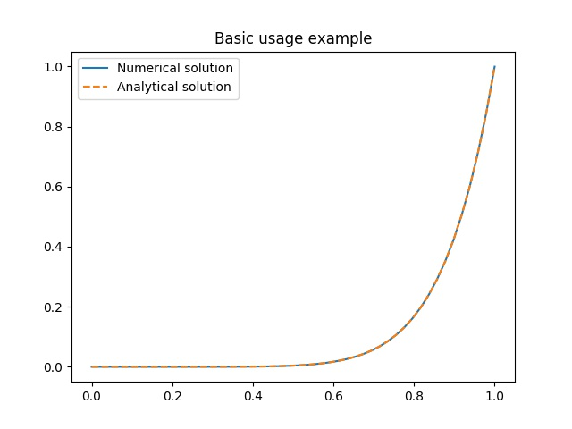
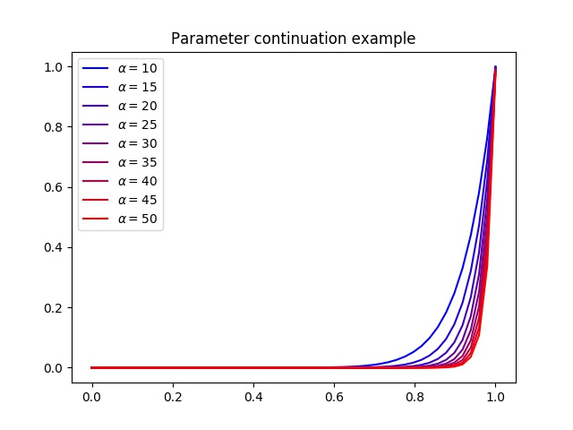

.. _examples:

Examples
========

You will need to have `matplotlib <https://matplotlib.org/>`_ installed to run these examples. ::

  pip install matplotlib

.. _basic_example:

Basic usage example
===================

We will solve the following system [1]_

.. math::
  y'(t) = y(y(t)) + (3+\alpha) t^{2 + \alpha} - t^{(3 + \alpha)^2}

where :math:`t \in [0,1]` and :math:`y(0) = 0`.

First we must write the :ref:`problem definition <example_problem_definition>`. It is rather long so it is not included here but on a :ref:`separate page <example_problem_definition>`. Some methods of the :class:`.BVPSolution` class and some extra methods were used to help define the system.

Copy the :ref:`problem definition <example_problem_definition>` and save it as :code:`test_system.py`. We will solve the system for :math:`\alpha = 5`. First, import the necessary modules, including the problem definition, and setup the problem. ::

  import numpy as np
  from test_system import DAE
  from daepy import BVP
  from matplotlib import pyplot as plt

  alpha = 5
  dae = DAE(alpha)

Next we create a :class:`.BVP` class and give it an initial guess for the solution, in this case :math:`y(t) = 0`. ::

  degree = 3
  intervals = 10
  bvp = BVP(dae, degree, intervals)
  bvp.initial_guess([lambda x: 0], initial_interval=[0,1])

Now we can solve the system. ::

  sol = bvp.solve(method='nleqres', tol=1e-14, maxiter=100, disp=True)

Finally, we can plot the solution against the known analytic solution :math:`y(t) = t^{3+\alpha}`. ::

  l = np.linspace(0,1)
  plt.plot(l, sol(l)[0])
  plt.plot(l, l**(3+alpha), '--')

  plt.legend(['Numerical solution', 'Analytical solution'])
  plt.title('Basic usage example')
  plt.show()

This should produce a plot like this.

.. _continuation_example:

Parameter continuation example
==============================

We will solve the same system as in the :ref:`basic usage example <basic_example>` but this time for :math:`\alpha` from 10 to 50 using parameter continuation. The setup is the same as before. ::

  import numpy as np
  from test_system import DAE
  from daepy import BVP
  from matplotlib import pyplot as plt

  alpha = 10
  dae = DAE(alpha)

  degree = 3
  intervals = 20
  bvp = BVP(dae, degree, intervals)
  bvp.initial_guess([lambda x: 0], initial_interval=[0,1])

Now we define a callback function which will plot the solution at each continuation step. ::

  def callback(p, sol):
      colour = (min((p-10)/40, 1.0), 0.0, max(1-(p-10)/40, 0.0))
      l = np.linspace(0,1)
      plt.plot(sol.forward(l), sol[0](l), color=colour) # plot using internal coordinate for smoother lines

Now can perform the parameter continuation. ::

  steps = list(range(15,51,5))
  bvp.continuation(alpha, method='pseudo_arclength', steps=steps, tol=1e-14, maxiter=100, disp=True, callback=callback)

In this example we gave the continuation steps explicitly as a list but it is also possible to just give a number of steps and a target value for the parameter. Finally, we show the plot we have made. ::

  plt.legend([r'$\alpha = $' + str(s) for s in [alpha] + steps])
  plt.title('Parameter continuation example')
  plt.show()

This should produce a plot like this.

.. [1] L. Tavernini, *The Approximate Solution of Volterra Diff. Systems with State-Dependent Time Lags*, SIAM J. Num. Anal. Vol. 15 (1978). 1039-1052
